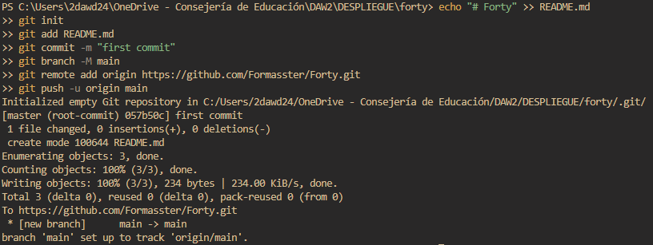
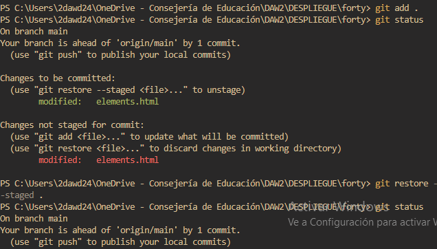

# Forty

### Alesia Rubtsova

# 01 - Ejercicio de Git - Forty - local y remoto

## Trabajo en local

1. Inicializa un nuevo repositorio Git en una carpeta llamada "forty" y agrega los archivos
proporcionados en el aula virtual.



1. Renombra la rama master a main: Los commandos de github preparados ya renombran la rama a “main” de manera automática. 
2. Haz que los ficheros README.txt , LICENSE.txt y passwords.txt sean ignorados por el control
de versiones

Creamos el archivo `.gitignore` y metemos ahí los archivos;


```bash
git ls-files --others -i --exclude-standard
```


1. Crea el archivo passwords.txt . Comprueba que el control de versiones lo ignora

Creamos el archivo y comprobamos con el mismo comando que en el ejercicio anterior:


1. Crea una rama llamada "feature-content" . Muévete a esa rama. Cambia, en la línea 3477, el
font-size por 1.5em en el archivo main.css . Confirma cambios y haz commit. Muestra los logs
de la forma más gráfica posible.

```bash
> git branch "feature-content"
> git chechkout "feature-content"
```


```bash
> git add .
> git commit -m "gitignore y cambio de estilo"
```


1. Elimina el archivo "passwords.txt" en la carpeta forty . Verifica el estado del repositorio. ¿Hay cambios pendientes? 

```bash
git status 
```


1. Crea un nuevo archivo llamado " about.html ", partiendo del archivo generic.html y agrégalo al
repositorio, haz un nuevo commit.

```bash
git add .
git status
git commit -m "about added"
```


1. Cambia a la rama main . Examina los logs del repositorio de forma gráfica.

```bash
git checkout main 
git log --graph --oneline --all
```


1. Modifica algo en el archivo generic.html , comprueba que hay cambios, y realiza otro commit .
Examina los logs del repositorio de forma gráfica.


```bash
git add .
git commit -m "cambio de generic"
git log --graph --oneline --all
```


1. Modifica algo en el fichero elements.html . Confirma los cambios, pero no hagas commit.


```bash
git add .
```

1. Mira las diferencias de elements.html . Los cambios no nos gustan, deshaz los cambios de
elements.html . Comprueba que no hay cambios pendientes.

```bash
git status
```


```bash
git restore --staged .
```



1. Muestra las diferencias entre dos ramas.
    
    ```bash
    git diff main..feature-content
    ```
    
    
    

La cantidad de cambios es enorme, así que no muestro todo.

13. Fusiona la rama "feature-content" con la rama principal (main). Muestra los logs del
repositorio de una forma gráfica y completa.

```bash
git merge feature-content
```


Resolvemos el conflicto aparecido.

14. Crea una nueva rama llamada " hotfix " y en ella, corrige un error crítico en el archivo
" index.html ". (Por ejemplo, añade el enlace a la nueva página about.html)

```bash
git branch hotfix
git checkout hotfix
```


```bash
git add .
git commit -m "corrigiendo menu"
```


15. Fusiona la rama "hotfix" con la rama principal y verifica el historial de commits de forma que se
vean todas las ramas gráficamente. ¿Borrarías la rama hotfix ? ¿En qué caso? ¿Cómo?

```bash
git checkout main
git merge hotfix
git log --oneline --graph --all --decorate
```


```bash
git branch -d hotfix
```

Se usaría este comando, siendo la rama fusionada previamente. Se eliminaría en el caso de que no tengamos que corregir ya nada y el proyecto esté acabado. 

16. Muestra el historial de cambios limitado a los últimos 3 commits.

```bash
git log -n 3
```


17. Etiqueta el commit actual como "v1.0" y muestra las etiquetas existentes.

```bash
git tag v1.0
git tag
```

